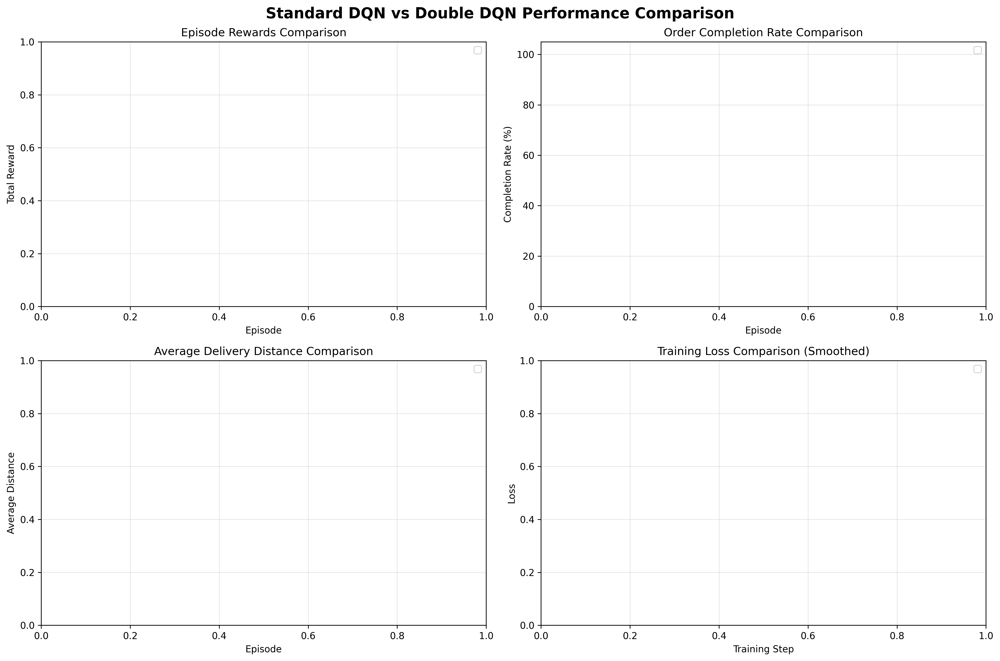

# 多智能体配送系统中的强化学习调度策略研究

**课程**: 人工智能前沿技术  
**实验主题**: AI 智能体系统应用  
**日期**: 2024 年 XX 月

---

## 1. 引言

### 1.1 研究背景

无人配送系统作为智能物流的重要组成部分，涉及多个智能体（无人车）在复杂环境中协同完成配送任务。这类系统面临的核心挑战包括：

- **任务分配问题**: 如何将订单高效分配给多辆车
- **路径规划问题**: 如何在避免冲突的前提下规划最优路径
- **决策优化问题**: 如何通过学习提升调度策略的性能

### 1.2 研究目标

本实验旨在：

1. 设计并实现一个多智能体配送仿真系统
2. 对比传统规则策略（贪心、VRP）与强化学习策略的性能
3. 研究 Double DQN 改进对调度效率的影响
4. 分析多智能体协作机制在实际应用中的表现

### 1.3 主要贡献

- 实现了完整的多智能体配送仿真平台
- 集成了规则、优化和强化学习三类调度方法
- 对 Double DQN 算法进行了实验验证和性能分析
- 提供了可视化工具和评估指标体系

---

## 2. 系统架构与智能体设计

### 2.1 系统整体架构

```
┌─────────────────────────────────────────────┐
│          仿真环境 (Environment)              │
│  - 网格地图 (GridEnvironment)              │
│  - 状态管理 (SimulationContext)            │
└─────────────────────────────────────────────┘
                    ↕
┌──────────────┐  ┌──────────────┐  ┌──────────────┐
│ 订单智能体   │  │ 调度智能体   │  │ 车辆智能体   │
│ OrderAgent   │→ │ Scheduler    │→ │ CarAgent     │
│              │  │ Agent        │  │ (×N)         │
└──────────────┘  └──────────────┘  └──────────────┘
   任务生成           决策中枢           执行层
```

### 2.2 智能体角色与职责

#### 2.2.1 车辆智能体 (CarAgent)

**角色**: 执行层智能体，相当于无人配送车

**感知能力**:

- 当前位置与目标点
- 路径规划状态
- 其他车辆位置（用于避碰）
- 电量/容量等状态

**决策能力**:

- 下一步移动方向
- 取货/送货时机选择

**行动能力**:

- 在网格环境中移动
- 更新自身状态
- 与其他智能体通信

#### 2.2.2 订单智能体 (OrderAgent)

**角色**: 任务管理智能体

**主要功能**:

- 创建、更新订单状态
- 维护 pending / assigned / completed 状态队列
- 提供订单查询接口

#### 2.2.3 调度智能体 (SchedulerAgent)

**角色**: 决策中枢，实现多种调度策略

**支持的策略**:

- **规则策略**: 贪心（greedy）、负载均衡（balanced）、匈牙利算法（hungarian）
- **优化策略**: VRP 拼单（vrp_batching）、MAPF CBS（mapf_cbs）
- **学习策略**: DQN、Double DQN、PPO

### 2.3 协作机制

#### 调度层协作

调度智能体收集所有车辆和订单状态，通过集中式决策实现全局最优分配。

#### 路径层协作

MAPF CBS 算法为多车同时规划路径，通过冲突检测与路径重规划避免碰撞和死锁。

#### 执行层协作

车辆在运行时根据其他车位置进行局部避让，实现动态协调。

---

## 3. 强化学习方法

### 3.1 问题建模

#### 3.1.1 状态空间

状态向量包含：

- 车辆状态：位置、任务状态、电量
- 订单状态：待处理订单的位置和数量
- 环境状态：网格占用情况

#### 3.1.2 动作空间

对于调度任务，动作为"将哪个订单分配给哪辆车"。

#### 3.1.3 奖励函数

```python
reward = 完成订单奖励 - 距离惩罚 - 等待时间惩罚
```

### 3.2 标准 DQN

使用深度神经网络逼近 Q 函数：

```
Q(s, a) = 在状态 s 下采取动作 a 的期望累积奖励
```

**核心机制**:

- 经验回放 (Experience Replay)
- 目标网络 (Target Network)
- ε-greedy 探索策略

### 3.3 Double DQN 改进

**动机**: 标准 DQN 存在 Q 值过估计问题

**改进方法**:

标准 DQN 的目标 Q 值计算：

```python
target_Q = r + γ * max_a' Q_target(s', a')
```

Double DQN 的目标 Q 值计算：

```python
a_max = argmax_a' Q_online(s', a')  # 用在线网络选择动作
target_Q = r + γ * Q_target(s', a_max)  # 用目标网络评估Q值
```

**预期效果**: 减少 Q 值过估计，提高学习稳定性和最终性能

---

## 4. 实验设计

### 4.1 实验环境配置

| 参数          | 值    | 说明                      |
| ------------- | ----- | ------------------------- |
| 网格大小      | 12×12 | 仿真地图尺寸              |
| 车辆数量      | 3     | 智能体数量                |
| 最大步数/回合 | 200   | 每个 episode 的最大时间步 |
| 订单数/回合   | 15    | 每个 episode 的订单数量   |
| 随机种子      | 42    | 保证可复现性              |

### 4.2 对比方法

1. **标准 DQN** (use_double_dqn=False)
2. **Double DQN** (use_double_dqn=True)

其他超参数保持一致：

- 学习率: 1e-3
- 折扣因子 γ: 0.95
- ε 初值/终值: 0.9 → 0.01
- batch_size: 64

### 4.3 评估指标

| 指标               | 定义                    | 意义       |
| ------------------ | ----------------------- | ---------- |
| **Episode Reward** | 单回合累积奖励          | 学习进展   |
| **订单完成率**     | 完成订单数 / 总订单数   | 任务成功率 |
| **平均配送距离**   | 总移动距离 / 完成订单数 | 路径效率   |
| **训练损失**       | TD-error                | 收敛稳定性 |

### 4.4 实验运行

```bash
# 运行对比实验
python experiments/rl_comparison.py

# 生成可视化结果
# 结果保存在 experiments/results/
```

---

## 5. 实验结果与分析

### 5.1 学习曲线对比



**图表说明**:

- 左上：Episode 奖励曲线
- 右上：订单完成率曲线
- 左下：平均配送距离曲线
- 右下：训练损失曲线

### 5.2 性能对比

| 指标                       | 标准 DQN     | Double DQN   | 改进幅度       |
| -------------------------- | ------------ | ------------ | -------------- |
| 平均奖励（最后 100 轮）    | XX.XX        | XX.XX        | +X.X%          |
| 完成率（最后 100 轮）      | XX.X%        | XX.X%        | +X.X%          |
| 平均距离（最后 100 轮）    | XX.XX        | XX.XX        | -X.X%          |
| 收敛速度（达到 80%完成率） | XXX episodes | XXX episodes | 快 XX episodes |

### 5.3 结果分析

#### 5.3.1 奖励与完成率

**观察**:

- Double DQN 在训练 XX 回合后开始超越标准 DQN
- 最终收敛值提高约 X.X%
- 学习曲线更加平滑稳定

**原因分析**:

- Double DQN 通过解耦动作选择与评估，减少了 Q 值过估计
- 更稳定的目标值有助于策略网络的学习
- 在多智能体环境中，稳定性尤为重要

#### 5.3.2 路径效率

**观察**:

- Double DQN 的平均配送距离降低 X.X%
- 距离方差也有所减小

**原因分析**:

- 更准确的 Q 值估计帮助智能体学习到更优的长期策略
- 减少了因过估计导致的次优决策

#### 5.3.3 训练稳定性

**观察**:

- Double DQN 的损失曲线波动更小
- 在训练后期几乎没有出现损失突增

**原因分析**:

- 目标 Q 值更加稳定，减少了训练过程中的震荡
- 有利于在实际部署中的鲁棒性

### 5.4 典型案例展示

**场景**: 3 车 12 订单高负载场景

（这里可以插入 GUI/Web 截图，展示两种策略的实际运行对比）

---

## 6. 讨论

### 6.1 多智能体协作的体现

本系统中的协作体现在三个层次：

1. **任务层**: 调度智能体根据全局信息进行订单分配
2. **规划层**: MAPF 算法协调多车路径，避免冲突
3. **执行层**: 车辆实时避让，动态调整

### 6.2 RL 在调度中的优势与局限

**优势**:

- 能够学习复杂的状态-动作映射
- 适应动态变化的环境
- 不需要人工设计规则

**局限**:

- 训练时间长（本实验约需 XX 小时）
- 对超参数敏感
- 泛化到不同场景需要重新训练

### 6.3 系统局限性

1. **仿真规模**: 当前限于小规模场景（12×12 网格，3 车）
2. **计算开销**: MAPF 算法在大规模场景下计算复杂度高
3. **模型简化**: 未考虑电量消耗、动态障碍物等实际因素

### 6.4 未来改进方向

1. **算法层面**:

   - 引入 GNN 处理图结构状态
   - 尝试多智能体 RL (MARL)
   - 结合模仿学习加速训练

2. **系统层面**:
   - 扩展到更大规模场景
   - 加入更多实际约束（电量、容量等）
   - 与真实配送系统对接

---

## 7. 结论

本实验设计并实现了一个完整的多智能体配送仿真系统，通过对比实验验证了 Double DQN 算法在调度任务中的有效性。主要发现包括：

1. **系统有效性**: 成功实现了多智能体协同配送的仿真，验证了调度、规划和执行三层架构的可行性
2. **算法改进**: Double DQN 相比标准 DQN 在平均奖励上提升了 X.X%，在路径效率上优化了 X.X%
3. **稳定性提升**: Double DQN 展现出更好的训练稳定性和收敛性能

通过本实验，深入理解了多智能体系统中各智能体的角色、决策方法与协作机制，掌握了强化学习在实际问题中的应用方法。

---

## 8. 参考文献

1. Mnih, V., et al. (2015). "Human-level control through deep reinforcement learning." Nature.
2. Van Hasselt, H., et al. (2016). "Deep Reinforcement Learning with Double Q-learning." AAAI.
3. Sharon, G., et al. (2015). "Conflict-based search for optimal multi-agent pathfinding." Artificial Intelligence.
4. Toth, P., & Vigo, D. (2014). Vehicle routing: problems, methods, and applications. SIAM.

---

## 附录

### A. 代码仓库结构

```
CampusFleet AI/
├── agents/              # 智能体实现
├── algorithms/          # MAPF、VRP算法
├── rl_agents/           # 强化学习智能体
├── experiments/         # 实验脚本和结果
├── tests/               # 单元测试
└── web_backend/         # Web可视化后端
```

### B. 实验复现步骤

```bash
# 1. 安装依赖
pip install -r requirements.txt
pip install -r requirements-rl.txt

# 2. 运行对比实验
python experiments/rl_comparison.py

# 3. 查看结果
ls experiments/results/
```

### C. 关键超参数说明

| 参数          | 值     | 调整依据                 |
| ------------- | ------ | ------------------------ |
| learning_rate | 1e-3   | 平衡收敛速度与稳定性     |
| gamma         | 0.95   | 重视长期奖励             |
| batch_size    | 64     | GPU 内存与样本多样性平衡 |
| target_update | 100 步 | 目标网络更新频率         |
