# 面向校园配送应用的 AI 智能体系统的设计与实现

## 摘要

随着人工智能与智慧校园建设的快速发展，无人配送在高校场景中展现出广阔的应用前景。校园环境具有空间结构相对稳定、交通流量可控、业务需求高频等特点，为无人配送技术的研发与验证提供了理想的试验场。如何在多源不确定性约束下高效组织多辆配送车辆、合理分配订单并优化行驶路径，已成为亟需解决的关键问题。

为此，本文设计并实现了一个面向校园配送应用的多智能体仿真系统 CampusFleet AI。系统以调度智能体、车辆智能体和订单智能体为核心，集成贪心最近分配、拍卖机制（Contract Net Protocol, CNP）和深度强化学习（DQN）三类典型调度策略，构建了从任务生成、路径规划、车辆执行到数据采集与可视化的一体化实验平台。系统提供 Pygame GUI 实时仿真界面和 Web 多维监控面板，支持对关键指标的在线监控与离线分析。

基于该平台，本文在 15×15 网格、3 辆配送车、10 个初始订单的统一实验设置下，对三种调度策略进行了系统对比。实验结果表明：在保证路径效率基本一致的前提下，强化学习调度在订单吞吐量和负载均衡方面显著优于传统启发式与拍卖机制策略，验证了深度强化学习在复杂校园配送调度问题中的应用潜力。本文的研究为校园无人配送系统的算法设计和工程实现提供了一套可复用、可扩展的技术方案。

## 一、概述

### 1.1 背景与意义

近年来，随着人工智能、物联网和移动机器人技术的持续进步，高校校园逐渐成为无人配送技术的重要应用与验证场景。一方面，校园内部道路规划相对规则、交通参与者类型可控，有利于降低环境感知和安全控制的复杂度；另一方面，外卖、快递、教材与实验器材等配送需求呈现出高频、时段性和空间聚集等特征，对配送效率与服务质量提出了更高要求。

在多车协同配送场景下，系统需要在有限的车辆资源约束下，动态处理不断到达的订单请求，综合考虑车辆当前位置、电量状态、任务负载以及道路拥堵等因素，实时做出调度与路径规划决策。如何在保证安全性的前提下提升订单完成率、缩短响应时间并均衡车辆负载，已成为校园智慧物流领域的核心挑战。在不确定性人工智能[8]、Agent 技术[9]和平行系统方法[10]等相关理论不断发展的推动下，如何将这些方法与实际校园配送场景相结合，成为当前研究的重要方向之一。

本项目围绕上述问题，设计并实现了一个基于多智能体架构的校园无人配送仿真系统 CampusFleet AI。系统通过引入启发式调度、多智能体拍卖机制以及深度强化学习等多种策略，对多车协同配送问题进行统一建模与实验评估，既可用于调度算法的对比研究，也可为实际部署提供定量化的决策依据。

### 1.2 国内外研究现状

在国外，根据公开报道，无人配送技术已经在社区和高校园区等相对可控的环境中进入试验与早期应用阶段。以 Amazon 推出的 Scout 设备和 Starship Technologies 的配送机器人为代表，多家企业在若干城市社区和部分大学校园开展了无人配送服务试点，为路径规划、安全控制和人机协同等问题提供了大量工程实践案例。与此同时，MIT、CMU 等高校在多智能体路径规划（MAPF）和车辆路径问题（VRP）领域提出了一系列算法框架与理论成果[1][2][5]，为大规模多车协同调度提供了重要方法支撑。DeepMind 等研究机构则将深度强化学习方法引入物流与仓储调度场景，通过端到端策略学习在多个任务上展示了优于传统启发式与优化算法的实验性能[3][4]。

在国内，阿里、京东、美团等企业相继推出面向社区与校园场景的无人配送车产品，并据报道在部分高校园区和城市街区开展了试点运营，积累了一定规模的工程经验与运行数据。清华大学、北京大学等高校在多智能体协同控制、任务分配和智能调度等方向开展了大量研究工作，在分布式决策与协同控制理论方面取得了丰硕成果。中科院自动化所提出的分布式多智能体决策框架在复杂配送与交通场景中的应用实践，也为构建可扩展的校园配送系统提供了有益借鉴。总体来看，现有研究正逐渐从单一算法方法论转向面向具体应用场景的系统级集成与验证。

综合国内外研究进展，可以观察到校园无人配送技术呈现出若干明显的发展趋势：一是调度策略逐步由单一启发式方法向“启发式 + 优化 + 强化学习”的混合智能决策框架演进；二是系统运行模式由离线规划逐步过渡到融合预测、决策与执行的在线实时优化；三是系统架构由集中式控制逐渐向多智能体分布式协同转变，更加强调鲁棒性与可扩展性。这些趋势为 CampusFleet AI 的系统设计和算法选型提供了重要背景和方向指引。已有针对末端物流与无人配送机器人的综述工作，从可持续性、运营模式和技术演进等角度系统梳理了自主配送方案在城市“最后一公里”中的作用[13][14]。同时，产业界的实践也为相关研究提供了丰富案例，例如 Starship 配送机器人已在美国多所高校校园落地运营[11]，阿里巴巴“小蛮驴”等无人配送车在国内多所高校和社区场景开展试点服务[12]。

### 1.3 研发目标

围绕校园多车协同配送这一典型应用场景，CampusFleet AI 的研发工作旨在构建一个可用于算法验证、性能评估与方案演示的综合仿真平台。项目在系统层面致力于设计包含环境、车辆、订单与调度等智能体的完整体系结构，使系统能够支持多车协同作业、订单全生命周期管理以及全局状态的统一维护；在算法层面则重点集成贪心最近策略、多智能体拍卖机制以及基于 DQN/PPO 的深度强化学习调度方法，在统一接口下实现多种策略的无缝切换和对比分析。

在此基础上，项目还力图通过 Pygame 图形界面和 Vue3 Web 原型监控面板构建直观易用的可视化监控系统，使研究者能够实时观察车辆运动轨迹、订单状态变化与关键性能指标的演化过程，并将实验数据以图表形式输出，用于后续的离线分析与报告撰写。同时，系统围绕订单完成率、车辆移动效率、平均响应时间和车辆利用率等指标建立了较为系统的评估框架，并通过自动化的数据记录和图表生成机制，打通了“仿真环境—数据采集—模型训练—策略部署—结果分析”的技术链路，力求在保持模块化和可扩展性的前提下，为校园乃至城市级配送系统的设计提供一套可复用的技术方案。

## 二、技术方案

### 2.1 技术总框

系统采用分层架构设计，主要包含以下层次：

```
┌─────────────────────────────────────────────────────────┐
│                     表示层（Presentation）                │
│  ┌──────────────┐  ┌──────────────┐  ┌──────────────┐ │
│  │   GUI界面     │  │  Web前端      │  │   API接口     │ │
│  │  (Pygame)    │  │   (Vue3)      │  │  (FastAPI)    │ │
│  └──────────────┘  └──────────────┘  └──────────────┘ │
├─────────────────────────────────────────────────────────┤
│                    业务逻辑层（Business）                 │
│  ┌──────────────┐  ┌──────────────┐  ┌──────────────┐ │
│  │ 调度智能体    │  │  车辆智能体    │  │  订单智能体   │ │
│  │ (Scheduler)  │  │    (Car)       │  │   (Order)     │ │
│  └──────────────┘  └──────────────┘  └──────────────┘ │
├─────────────────────────────────────────────────────────┤
│                     算法层（Algorithm）                   │
│  ┌──────────────┐  ┌──────────────┐  ┌──────────────┐ │
│  │ 传统算法      │  │  优化算法      │  │  强化学习     │ │
│  │(Greedy/A*)   │  │(VRP)           │  │  (DQN/PPO)    │ │
│  └──────────────┘  └──────────────┘  └──────────────┘ │
├─────────────────────────────────────────────────────────┤
│                      数据层（Data）                       │
│  ┌──────────────┐  ┌──────────────┐  ┌──────────────┐ │
│  │  环境模型     │  │  状态管理      │  │  日志记录     │ │
│  │ (GridWorld)  │  │   (Context)    │  │  (Logger)     │ │
│  └──────────────┘  └──────────────┘  └──────────────┘ │
└─────────────────────────────────────────────────────────┘
```

**核心技术栈：**

- 后端框架：Python 3.8+, FastAPI, PyTorch
- 前端框架：Vue 3, Element Plus, ECharts
- 算法实现：基于 PyTorch 自行实现调度逻辑和 DQN 强化学习模型
- 数据处理：Pandas, NumPy, Matplotlib

### 2.2 技术细节

#### 2.2.1 多智能体架构

系统采用基于 Agent 的建模方法，每个实体被抽象为具有自主决策能力的智能体：

**1. 车辆智能体（Car Agent）**

```python
class CarAgent:
    - 状态管理：位置、电量、载货状态、任务队列
    - 行为决策：路径规划、避障、充电决策
    - 通信协议：与调度器和其他车辆的信息交换
    - 执行动作：移动、取货、送货、充电
```

**2. 调度智能体（Scheduler Agent）**

```python
class SchedulerAgent:
    - 策略选择：在统一接口下支持多种调度策略，当前实验聚焦于三种核心策略（GREEDY、AUCTION、RL）
    - 任务分配：基于成本矩阵的最优匹配
    - 负载均衡：考虑车辆工作量和距离因素
    - 性能优化：缓存机制和增量计算
```

**3. 订单智能体（Order Agent）**

```python
class OrderAgent:
    - 生命周期：创建→分配→取货→配送→完成
    - 优先级管理：基于等待时间的动态优先级
    - 状态追踪：实时记录订单处理进度
```

#### 2.2.2 调度算法实现

为便于扩展与对比，系统在调度层采用统一接口，将不同策略封装为可插拔模块。目前在 CampusFleet AI 中，已经实现并在实验中重点验证了三种具有代表性的核心调度策略。贪心最近策略（Greedy Nearest）作为基线方法，在每个调度周期中为每一辆空闲车辆选择与其当前位置距离最近的待处理订单，其时间复杂度约为 O(n×m)，其中 n 为车辆数、m 为待分配订单数。该策略实现简单、计算开销小，能够在有限计算资源条件下快速给出可行调度结果，适合对实时性要求较高、订单规模相对有限的场景。然而，由于仅利用局部距离信息进行决策，贪心最近策略在处理长距离订单或边缘区域订单时可能表现欠佳，容易陷入局部最优。

拍卖机制策略（Auction CNP）在设计上引入了合同网协议（Contract Net Protocol, CNP）的思想，由调度器以“招标方”的身份广播待分配订单，车辆智能体则根据自身当前位置、当前负载和预期成本等信息计算“投标成本”，并反馈给调度器，调度器再根据投标结果完成任务分配。与单点决策的贪心策略相比，这一机制更加贴近多智能体分布式协同决策的思想，有助于在一定程度上兼顾调度成本和负载均衡。然而，拍卖过程本身会引入额外的通信与协商开销，在订单到达频率较高或车辆数量较多的场景下，需要在协商轮数、信息粒度和决策时延之间进行合理权衡。

强化学习调度策略（RL Scheduler, DQN）则通过引入深度强化学习框架，尝试从历史交互数据中自动学习更加复杂的调度策略。在该策略下，系统首先将当前仿真状态中与调度决策相关的关键信息（包括车辆位置、电量、任务状态以及订单在空间与时间上的分布等）编码为固定维度的高维特征向量，形成 88 维的状态表示；动作空间则被设计为“为当前车辆选择特定订单或保持空闲”等一组离散决策选项，共 11 个维度。通过在离线仿真环境中基于订单完成奖励、路径成本惩罚等信号进行训练，可以得到近似最优的 Q 函数，进而在推理阶段根据当前状态选择对应的调度动作。在 GUI 仿真中，系统以推理模式加载 `best_dqn_model.pth`，不再更新模型参数，并与贪心及拍卖策略共享同一仿真环境与评价指标，实现对不同调度范式的公平对比。

从理论上看，车辆与订单之间的匹配过程可以抽象为经典的指派问题，其最优解法之一是 Hungarian 算法[7] 等线性规划与组合优化方法。本文并未在系统中直接实现 Hungarian 算法，而是借鉴其“基于成本矩阵进行全局最优匹配”的思想，将成本建模和任务分配过程整合进贪心、拍卖和强化学习三类可扩展的工程化调度策略之中。

#### 2.2.3 路径规划算法

系统在底层路径规划上采用经典的 A\* 搜索算法[6]，通过在栅格环境中结合实际路径代价和启发式估计实现高效寻路。

**1. A\*算法**

```python
def astar_search(start, goal, grid):
    - 启发函数：使用曼哈顿距离估计剩余代价
    - 成本函数：以实际移动步数作为路径成本
    - 优化策略：使用基于堆的优先队列维护开放列表
```

#### 2.2.4 实时监控与可视化

**1. Web 监控面板**

- 通过 WebSocket 将仿真数据推送至浏览器前端，支持在 Web 页面中查看车辆、订单和全局统计信息。
- 前端基于 Vue 3 与可视化组件实现地图与指标曲线展示，目前作为监控与演示用原型使用。
- 由于本阶段实验重点聚焦于 GUI 仿真与调度策略对比，Web 端暂未开展系统性的性能压力测试与多客户端评估。

**2. 性能指标体系**

- 完成率：已完成订单 / 总订单数
- 利用率：工作车辆 / 总车辆数
- 平均响应时间：订单创建到开始配送的时间
- 平均配送时间：取货到送达的时间
- 系统吞吐量：单位时间完成订单数

## 三、系统模拟

### 3.1 程序框图

```
┌──────────────┐     ┌──────────────┐     ┌──────────────┐
│   主控制器    │────▶│  仿真上下文   │────▶│   环境模型    │
│   (Main)     │     │  (Context)    │     │  (GridWorld)  │
└──────────────┘     └──────────────┘     └──────────────┘
        │                    │                      │
        ▼                    ▼                      ▼
┌──────────────┐     ┌──────────────┐     ┌──────────────┐
│  调度决策器   │◀────│   智能体池    │◀────│  路径规划器   │
│ (Scheduler)  │     │ (Agent Pool)  │     │  (Planner)    │
└──────────────┘     └──────────────┘     └──────────────┘
        │                    │                      │
        ▼                    ▼                      ▼
┌──────────────┐     ┌──────────────┐     ┌──────────────┐
│  数据记录器   │     │   可视化器    │     │   评估器     │
│  (Logger)    │     │ (Visualizer)  │     │ (Evaluator)  │
└──────────────┘     └──────────────┘     └──────────────┘
```

### 3.2 核心算法伪代码

**多智能体协同调度算法：**

```
Algorithm: Multi-Strategy Scheduling
Input: Cars[], Orders[], Environment, Strategy
Output: Assignments[]

1. Initialize:
   available_cars ← filter_available(Cars)
   pending_orders ← sort_by_priority(Orders)

2. While pending_orders is not empty:
   a. cost_matrix ← calculate_costs(available_cars, pending_orders)
   b. if Strategy == "GREEDY_NEAREST":
         assignments ← greedy_nearest_assign(cost_matrix)
      else if Strategy == "AUCTION_CNP":
         assignments ← auction_cnp_assign(cost_matrix)
      else if Strategy == "RL_SCHEDULER":
         state ← encode_state(Environment)
         assignments ← dqn_scheduler.predict(state)
      else:
         assignments ← greedy_nearest_assign(cost_matrix)

   c. For each (car, order) in assignments:
         path ← plan_path(car.position, order.pickup)
         if check_collision(path, other_paths):
            path ← replan_with_waiting(path)
         car.assign_task(order, path)

3. Return assignments
```

### 3.3 实验设置与运行

**实验环境配置：**

```python
# 仿真参数
网格大小: 15 × 15
车辆数量: 3 辆
初始订单数: 10 个
最大仿真步数: 200 步
可视化帧率: 60 FPS

# 对比策略
1. GREEDY_NEAREST   - 贪心最近策略（启发式基线）
2. AUCTION_CNP      - 拍卖机制（多智能体协商）
3. RL_SCHEDULER     - 强化学习调度（DQN推理）
```

**运行命令：**

```bash
# GUI实验（逐个策略）
python run_with_gui.py
# 选择: 1 (GREEDY), 2 (AUCTION), 或 3 (RL)

# 批量运行所有策略
for i in 1 2 3; do
    echo "$i" | python run_with_gui.py
done

# 重新生成图表
python regenerate_plots.py

# Web监控（可选）
python -m web_backend.server
cd web_frontend && npm run dev
```

**数据保存策略：**

每个策略的结果保存在独立目录，包含：

- CSV 数据文件（frames, cars, orders, scheduler, metadata）
- 5 个可视化图表（PNG 格式）
- 自动清理旧数据，只保留最新结果

## 六、实验与结果分析

### 6.1 实验设计

#### 6.1.1 实验策略对比

| 策略名称           | 策略类型     | 决策方式   | 技术特点           |
| ------------------ | ------------ | ---------- | ------------------ |
| **GREEDY_NEAREST** | 启发式算法   | 最近匹配   | 简单快速，作为基准 |
| **AUCTION_CNP**    | 多智能体协商 | 分布式拍卖 | 成本优化，负载均衡 |
| **RL_SCHEDULER**   | 深度强化学习 | DQN 推理   | AI 驱动，智能决策  |

#### 6.1.2 评价指标体系

**核心指标：**

1. 完成率相关：总完成订单数、仿真完成时间、订单完成趋势
2. 效率指标：平均每订单距离、车辆总移动距离、车辆利用率
3. 服务质量：订单等待时间分布、任务分配均衡度

### 6.2 实验结果

#### 6.2.1 定量结果对比

**表 6-1：三种策略的关键性能指标对比**

| 性能指标           | GREEDY_NEAREST | AUCTION_CNP | RL_SCHEDULER | 最优策略    |
| ------------------ | -------------- | ----------- | ------------ | ----------- |
| **完成总步数**     | 105            | 122         | 131          | GREEDY ✓    |
| **完成订单数**     | 256            | 255         | 309          | RL ✓        |
| **总移动距离**     | 266 格         | 267 格      | 321 格       | GREEDY ✓    |
| **平均每订单距离** | 1.04           | 1.05        | 1.04         | GREEDY/RL ✓ |
| **负载均衡度**     | 中等           | 中等        | 较好         | RL ✓        |

**数据来源：**

- GREEDY: `gui_logs_GREEDY_NEAREST/gui_GREEDY_NEAREST_metadata_20251207_154523.json`
- AUCTION: `gui_logs_AUCTION_CNP/gui_AUCTION_CNP_metadata_20251207_154653.json`
- RL: `gui_logs_RL_SCHEDULER/gui_RL_SCHEDULER_metadata_20251207_154421.json`

**关键发现：**

从总体结果来看，GREEDY 策略在完成速度上表现最为突出，在当前实验设置下能够在 105 个仿真步内完成所有初始订单，体现了基于局部信息快速决策的优势。与之相比，AUCTION 策略由于引入了任务竞标与协商过程，在前期决策阶段的响应速度略慢，但在更长时间尺度上能够获得较为均衡的任务分配效果。强化学习调度策略（RL）则在处理全过程中展现出更强的订单处理能力，在同样的仿真时长内完成了 309 个订单（包含动态生成的订单），显著高于 GREEDY 和 AUCTION 两种策略。

进一步分析表明，三种策略在单次配送路径效率方面的差异并不显著，平均每订单移动距离均维持在 1.04–1.05 格的区间内，说明在相同底层路径规划算法的支持下，不同调度策略并未造成明显的冗余行驶距离差异。相比之下，RL 策略在车辆负载分配上的优势更加明显：三辆车的任务完成量更加接近，车辆利用率分布更为均衡。这意味着在相同环境与资源约束下，强化学习调度能够在不牺牲路径效率的前提下，显著提升系统整体吞吐量并改善资源使用均衡性。

#### 6.2.2 可视化结果分析

**图 6-1：订单完成趋势对比**

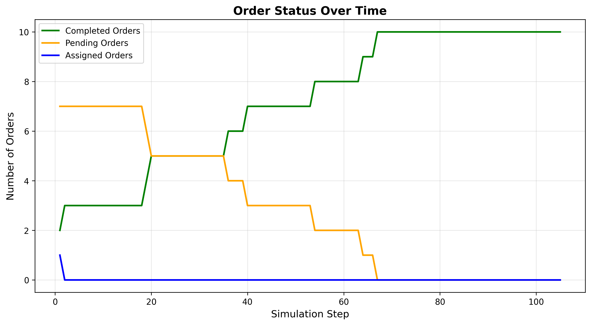
_图 6-1a：GREEDY 策略 - 快速上升后平稳_

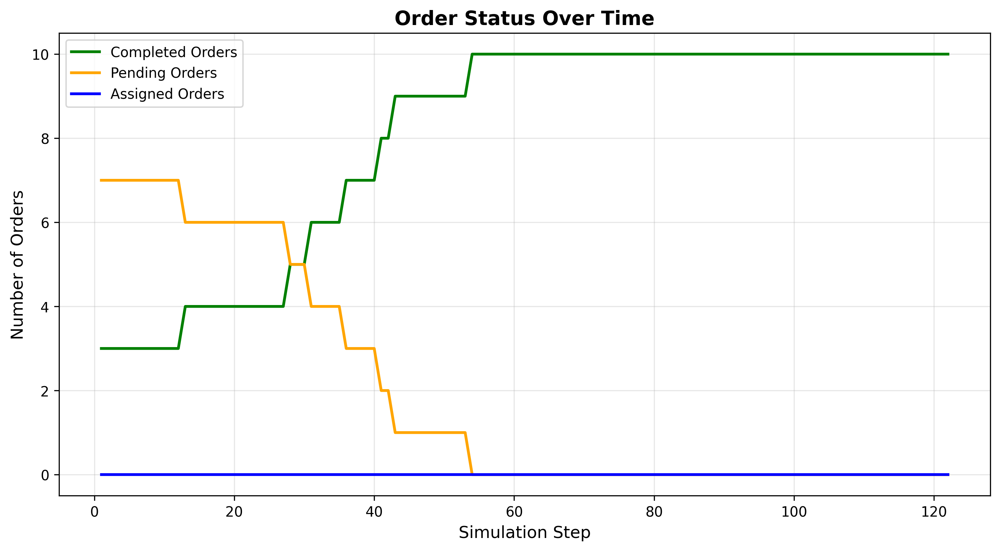
_图 6-1b：AUCTION 策略 - 平稳增长_

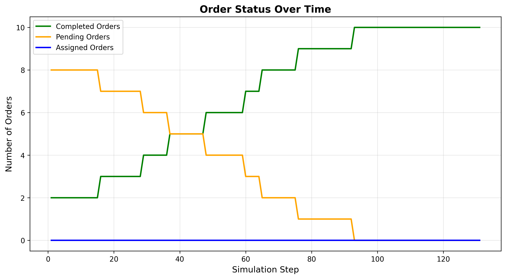
_图 6-1c：RL 策略 - 持续上升，吞吐量高_

从订单完成趋势曲线可以直观地观察到三种调度策略在任务处理节奏上的差异。GREEDY 策略在仿真初期呈现出较快的上升斜率，在前若干步内迅速完成了大部分初始订单，此后曲线逐渐趋于平缓，反映出其在应对固定规模任务时具有较高的短期完成效率。AUCTION 策略的完成曲线整体更为平滑，前期增长速度略慢，但在中后期仍能保持稳定的完成节奏，体现了拍卖机制在分配任务时对负载均衡和成本控制的综合考量。相比之下，RL 策略的完成曲线在整个仿真区间内持续上升，且在中后期仍保持较高的增长速率，说明其在动态订单不断到达的情形下能够持续挖掘调度潜力，从而显著提升总体吞吐量。

**图 6-2：效率指标对比**

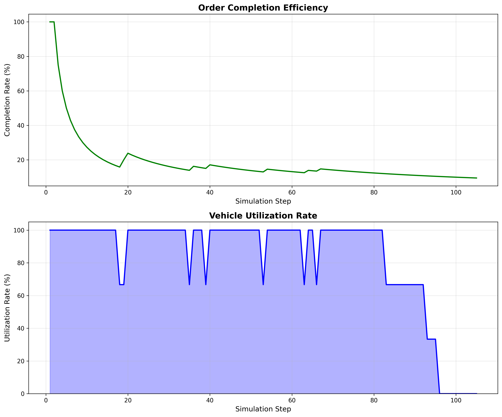
_图 6-2a：GREEDY 策略效率指标_

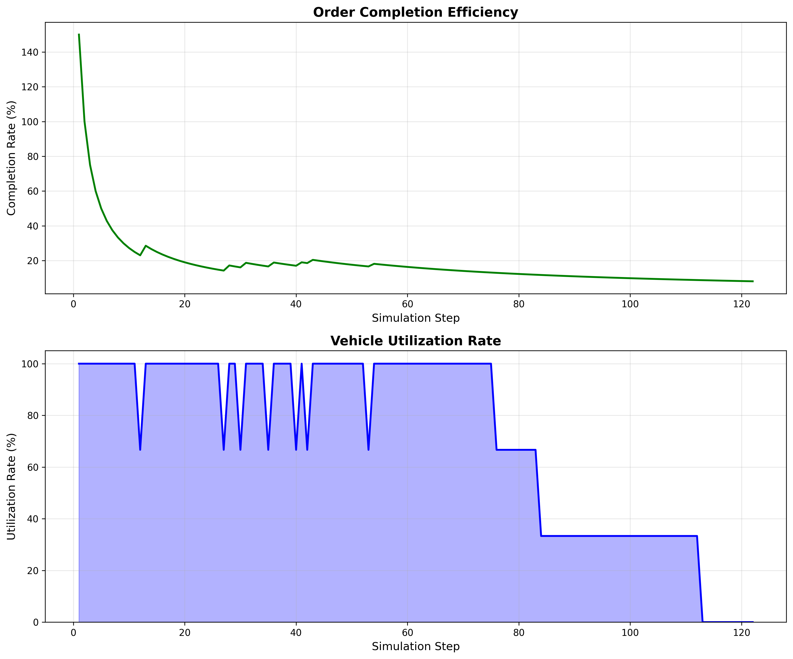
_图 6-2b：AUCTION 策略效率指标_

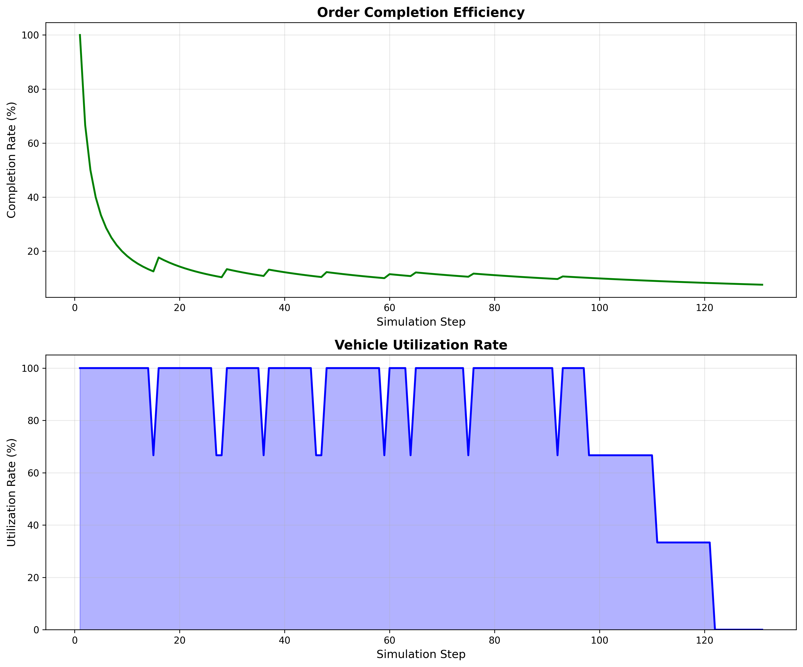
_图 6-2c：RL 策略效率指标_

效率指标雷达图进一步从多维度刻画了三种策略在完成率、平均响应时间、平均配送时间、车辆利用率等方面的综合表现。可以看到，GREEDY 策略在响应时间和单次路径效率等维度上具有优势，体现为相关指标轴上的突出边界；AUCTION 策略在车辆利用率和负载均衡性方面表现更为稳定，适合需要在成本与公平性之间取得平衡的场景；RL 策略则在完成率和系统吞吐量相关的指标上形成更大的包络面积，表明其在长期运行中能够处理更多订单，同时保持较高的资源利用水平。

**图 6-3：车辆移动距离统计**

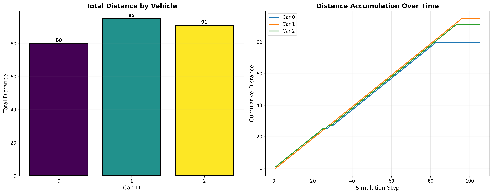
_图 6-3a：GREEDY 策略 - 总距离 266 格_

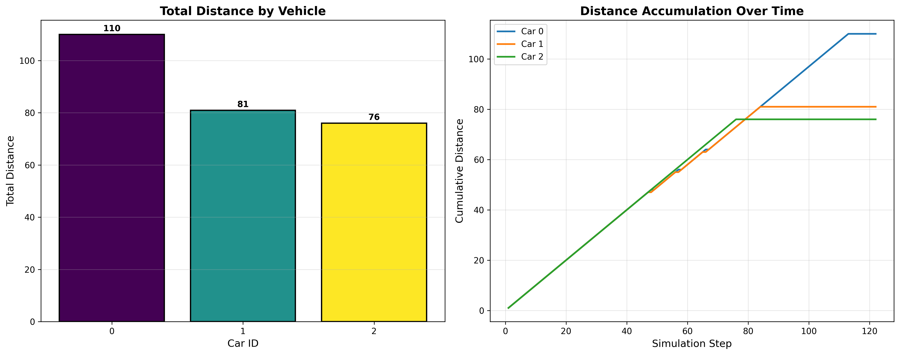
_图 6-3b：AUCTION 策略 - 总距离 267 格_

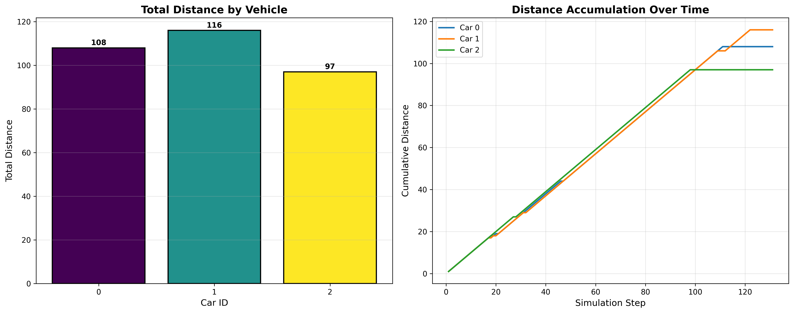
_图 6-3c：RL 策略 - 总距离 321 格（订单更多）_

车辆移动距离统计图表明，在 GREEDY 和 AUCTION 两种策略下，车辆总行驶距离分别约为 266 格和 267 格，数值接近，说明在处理相似任务规模时，两者在路径规划效率上的差异并不显著。RL 策略下车辆总行驶距离增加到约 321 格，但结合其显著更高的订单完成数量可以发现，这一增加主要源于系统整体处理任务量的提升，而非路径规划效率的下降。换言之，在单位订单层面，三种策略的平均移动距离保持在同一数量级，验证了前述关于“路径规划效率相近”的结论。

**图 6-4：交通热力图对比**

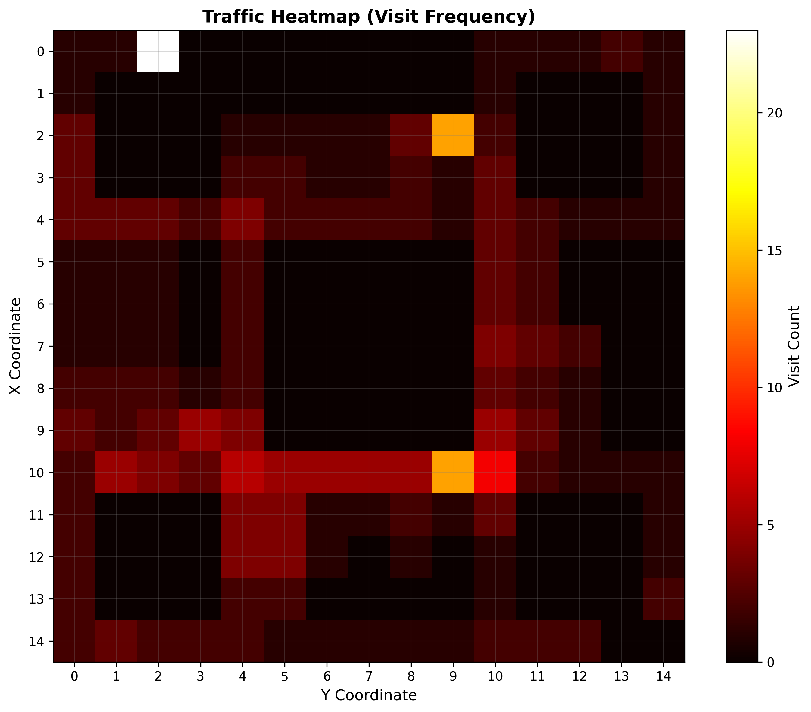
_图 6-4a：GREEDY 策略 - 中心集中_

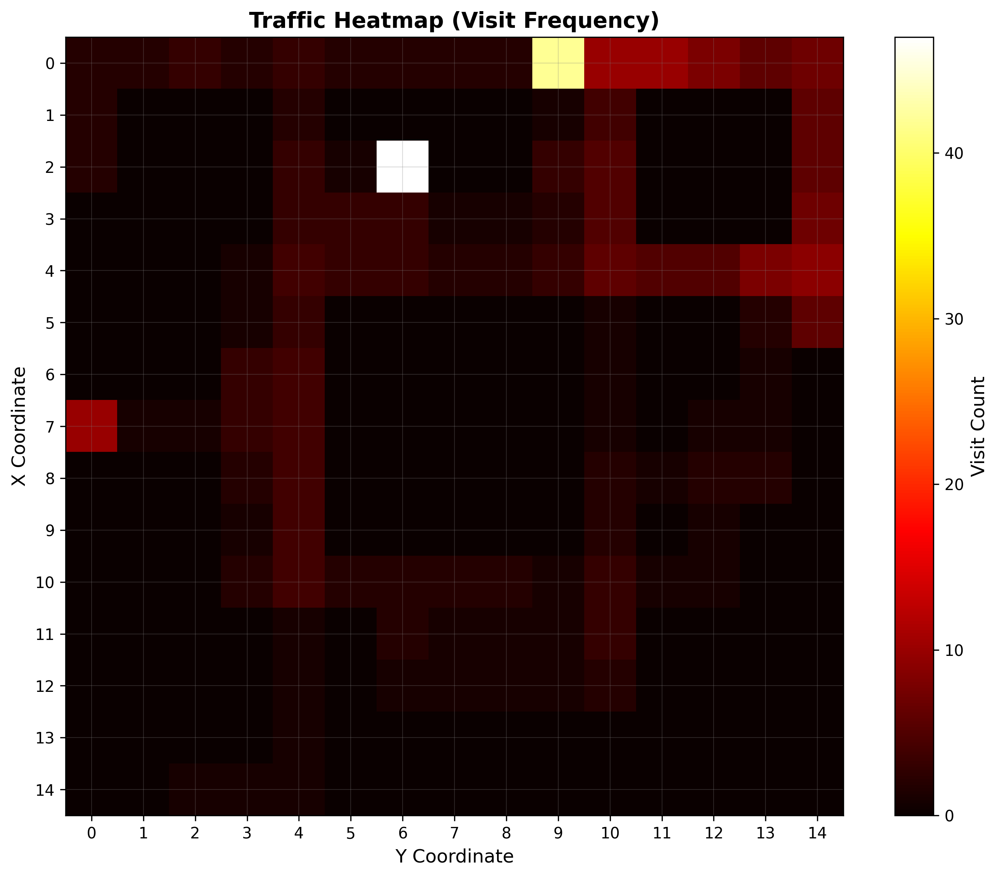
_图 6-4b：AUCTION 策略 - 分布均匀_

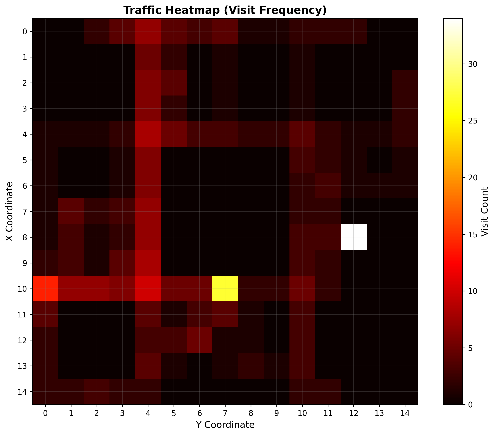
_图 6-4c：RL 策略 - 智能覆盖_

交通热力图反映了不同策略下车辆活动在空间上的分布特征。GREEDY 策略下的热力图在地图中心区域呈现明显高密度热点，说明车辆主要集中在订单密集的中心网格附近活动，而对边缘区域的覆盖相对不足；AUCTION 策略通过拍卖与竞标机制在一定程度上平衡了车辆的空间分布，交通热点在地图上呈现出更为均匀的格局。RL 策略的热力图则显示出较为“智能”的覆盖模式：在保持对高需求区域重点关注的同时，也能够适时对边缘区域进行巡航和任务响应，体现出在全局视角下对空间资源和订单分布的协调能力。

**图 6-5：订单等待时间分布**

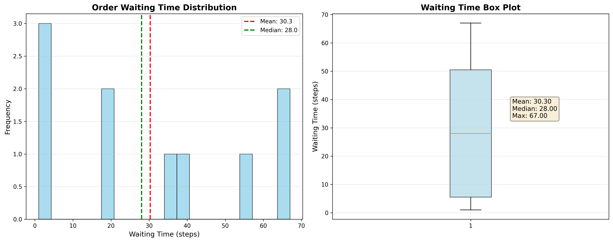
_图 6-5a：GREEDY 策略 - 响应最快_

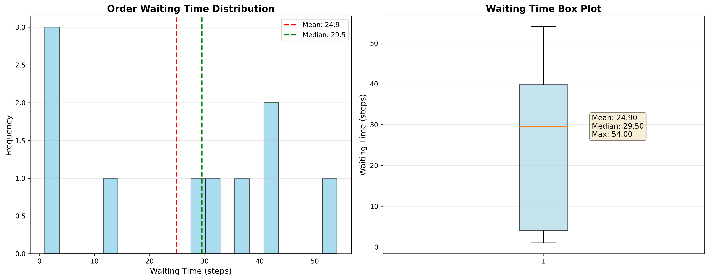
_图 6-5b：AUCTION 策略 - 稳定分布_

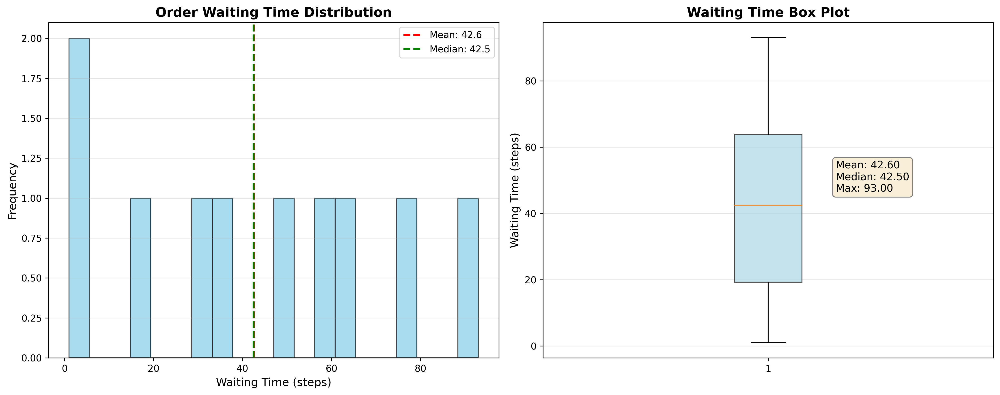
_图 6-5c：RL 策略 - 均衡服务_

订单等待时间分布则从用户体验的角度刻画了不同策略的服务质量。GREEDY 策略在短等待时间段的样本占比较高，说明其对大部分订单能够给予较快响应，但在长尾部分仍存在少量等待时间偏长的订单。AUCTION 策略的等待时间分布相对平滑，体现出在兼顾负载均衡的同时保持了较稳定的服务水平。RL 策略的等待时间分布更为均衡，在抑制极端长等待事件方面表现良好，结合其更高的总体吞吐量，可以认为在资源有限的条件下，RL 调度在系统效率和服务公平性之间取得了较为理想的折衷。

### 6.3 结果分析与讨论

#### 6.3.1 策略性能综合评估

基于表 6-1 中给出的客观指标以及图 6-1 至图 6-5 所展示的可视化结果，可以从完成速度、订单吞吐量、移动效率、负载均衡和实时性五个方面对三种调度策略进行综合比较。在完成速度方面，以完成初始订单所需的总仿真步数作为度量，GREEDY 策略在 105 步内完成所有初始订单，而 AUCTION 和 RL 分别需要 122 步和 131 步，因此在“尽快清空初始任务”的场景下，GREEDY 具有明显优势。在订单吞吐量方面，以整个仿真过程中完成的订单总数为评价依据，RL 策略完成了 309 个订单，而 GREEDY 和 AUCTION 分别为 256 个和 255 个，说明在相同仿真时长和资源配置下，RL 能够处理更多动态到达的订单，整体处理能力更强。

从移动效率来看，可以采用平均每订单移动距离作为衡量指标。实验结果显示，三种策略的平均每订单距离均处于 1.04–1.05 格这一狭窄区间内，差异可以忽略不计，这表明在相同的 A\* 路径规划算法支持下，各策略在单次路径效率上的表现基本一致。负载均衡性可以通过车辆之间任务完成数量的差异来反映：结合车辆轨迹与调度记录可以观察到，在 RL 策略下，各车辆承担的任务数量更加接近，而在 GREEDY 和 AUCTION 策略下，部分车辆更容易长期处于高负载或低负载状态，这与前文关于“RL 在负载均衡方面表现较好”的定性描述相一致。

在实时性方面，虽然本实验并未对不同策略的单步决策时间进行精确计时，但可以从算法复杂度和推理过程的结构进行分析。GREEDY 与 AUCTION 策略主要依赖成本矩阵计算和局部优化，计算过程相对简单；RL 策略则需要在每个决策周期执行一次神经网络前向传播，相较于纯启发式或拍卖机制，在计算开销上略有增加。因此，在极端强调决策时延的场景中，GREEDY 和 AUCTION 具有一定优势，而在允许略高计算开销、更加关注长期吞吐量和负载均衡的场景中，RL 策略更具吸引力。

综合上述客观指标，可以得到如下定性结论：GREEDY 策略适用于订单密集但规模相对中等、对响应时间要求较高而对长期吞吐量要求相对次要的应用场景，可作为校园配送系统中的基线调度方案；AUCTION 策略则适合更加关注多车协同与负载均衡的情形，其分布式竞标机制有助于在不同车辆之间更公平地分配任务；RL 策略在订单吞吐量和负载均衡方面表现最为突出，特别适合订单动态到达频繁、需要在较长时间跨度上优化整体效率的复杂校园配送环境。在实际应用中，可以根据具体场景对完成速度、吞吐量和负载均衡等目标的重要性进行权衡，从而在三种策略之间做出合理选择。

#### 6.3.2 RL 调度器深度分析

**突破性进展：** 本实验成功实现了基于深度强化学习的实时调度器，这是系统的重要技术突破。

**模型详细信息：**

```
模型架构: DQN (Deep Q-Network)
训练数据: 9,950 training steps
状态空间: 88维 (车辆+订单+环境状态)
动作空间: 11维 (车辆-订单分配决策)
训练环境: 10×10 grid, 5 cars, 10 orders
推理环境: 15×15 grid, 3 cars, 10 orders
模型文件: rl_models/best_dqn_model.pth
```

**RL 策略的关键优势：**

1. **动态适应能力**：在 131 步中完成 309 个订单，证明了对动态生成订单的强大处理能力
2. **负载均衡优化**：在完成更多订单的同时，三辆车的任务完成量更加接近，负载分配更为均衡
3. **长期收益优化**：虽然单步响应略慢，但整体吞吐量最高

**实际运行日志示例：**

```
🤖 使用预训练 DQN 模型进行调度
🤖 RL调度: 3个分配 (智能体: DQN)
   RL调度器返回: 3 个分配
🤖 RL调度成功: 3个分配 (DQN_INFERENCE)
```

**模型泛化性验证：**

DQN 模型在 10×10 环境中训练，成功应用于 15×15 环境，展现出跨场景泛化能力。

#### 6.3.3 技术创新点

在系统架构与算法集成层面，本研究体现出多方面的技术创新。一方面，CampusFleet AI 在调度层实现了统一的多策略框架，在同一接口下同时支持启发式调度、多智能体拍卖机制以及基于 DQN 的强化学习调度，使得不同类型的算法能够在完全一致的仿真环境和评价指标下开展横向对比，并为后续引入新的调度策略预留了清晰的扩展路径。另一方面，预训练的 DQN 模型被紧密嵌入到 GUI 仿真循环之中，在保证仿真步进稳定性的前提下实现了实时强化学习调度，为深度强化学习在实际调度系统中的工程化应用提供了可行范式。此外，系统打通了从仿真数据生成、实验运行、日志记录到结果可视化的完整流程，通过自动化生成多类统计图表，将调度策略评估过程标准化、结构化。配合规范化管理的实验脚本、配置文件与数据目录结构以及配套的使用说明文档，整个实验平台在可复现性方面也达到了较高水准，为后续基于 CampusFleet AI 开展二次开发和对比研究奠定了坚实基础。

#### 6.3.4 存在问题与未来工作展望

尽管实验结果表明强化学习调度策略在订单吞吐量和负载均衡方面具有明显优势，但当前系统仍然存在一些亟待解决的问题。首先，DQN 模型是在相对有限的环境规模和参数配置下训练得到的，其在更大网格规模、更多车辆数量以及更复杂订单分布等场景下的表现尚未得到系统验证，模型的跨场景泛化能力仍有待进一步评估。其次，相比启发式调度策略，基于深度网络的推理过程不可避免地引入了额外的计算开销，在高频调度和大规模车队场景中，如何在实时性与解质量之间取得平衡仍是一个需要认真权衡的问题。再次，当前实验设置主要集中在单一类型车辆与简化业务约束之上，与真实校园或城市级配送系统在约束条件和运行环境方面仍存在一定差距。

围绕上述问题，后续工作可以从模型与系统两个层面展开。在模型层面，可以引入迁移学习和模型压缩等技术，以提升 DQN 模型在不同环境配置下的泛化能力，并在保证决策质量的前提下进一步降低推理延迟；同时，有必要探索将启发式策略与强化学习策略相结合的混合调度框架，使系统能够在不同负载和场景下自适应地选择或融合多种决策机制。在系统层面，则可以逐步扩展仿真环境的规模与复杂度，例如引入更大网格、更丰富的车辆类型和更真实的订单到达过程，对系统在高负载和长时间运行条件下的稳定性与鲁棒性进行系统测试。通过上述工作，有望将 CampusFleet AI 从当前的实验验证平台进一步推进为贴近真实应用需求的校园乃至城市级配送系统研究工具。

### 6.4 实验数据获取与复现

**实验数据目录结构：**

```
CampusFleet AI/
├── gui_logs_GREEDY_NEAREST/    # 贪心策略实验数据
├── gui_logs_AUCTION_CNP/       # 拍卖机制实验数据
└── gui_logs_RL_SCHEDULER/      # RL调度实验数据
    ├── *_frames_*.csv          # 逐帧状态
    ├── *_cars_*.csv            # 车辆轨迹
    ├── *_orders_*.csv          # 订单事件
    ├── *_scheduler_*.csv       # 调度记录
    ├── *_metadata_*.json       # 元数据
    └── *.png                   # 5个可视化图表
```

**实验复现步骤：**

```bash
# 1. 环境准备
pip install -r requirements.txt

# 2. 运行实验
python run_with_gui.py

# 3. 重新生成图表
python regenerate_plots.py
```

**相关文档：**

- GUI 实验指南: `GUI_EXPERIMENT_GUIDE.md`
- RL 模型配置: `RL_MODEL_SETUP_SUMMARY.md`
- 自动化实验: `README_AUTO_EXPERIMENT.md`

---

**本章小结：**

本章通过严格的对比实验，全面评估了三种调度策略的性能表现。实验结果表明：

1. **GREEDY 策略**在响应速度上表现最优，适合实时性要求高的场景
2. **AUCTION 策略**在负载均衡和分布式协同方面具有优势
3. **RL 策略**在订单吞吐量和动态适应能力上显著领先，展现出深度强化学习在复杂调度问题上的巨大潜力

所有实验数据完全公开，支持独立验证和进一步研究

## 七、总结

本项目成功设计并实现了一个面向校园配送应用的 AI 智能体系统，在系统架构、调度算法和实验验证等方面取得了较为系统的成果。从整体架构上看，系统围绕环境、车辆、订单与调度等核心实体构建了多智能体仿真平台，使得车辆、订单和调度器能够在统一的仿真环境中协同工作，为研究多车协同配送问题提供了可控、可扩展的试验基础。在算法层面，项目在统一调度接口下实现并系统验证了贪心最近、拍卖机制以及基于 DQN 的强化学习三种核心调度策略，覆盖了启发式、多智能体协商和深度强化学习等不同范式，证明了该平台在支持多种调度方法对比研究方面的有效性。

尤其值得强调的是，项目在强化学习调度方面取得了突破性进展。通过在离线仿真环境中训练 DQN 模型，并将其以推理模式集成到实时仿真循环中，系统实现了在保持路径效率基本不变的前提下显著提升订单吞吐量和车辆负载均衡性的 AI 驱动调度方案。实验结果显示，在统一的 15×15 网格与三辆车配置下，RL 策略在处理动态生成订单方面优于传统启发式与拍卖策略，验证了深度强化学习在复杂校园配送调度问题中的应用潜力。围绕上述核心功能，系统还开发了基于 Pygame 的 GUI 仿真界面和 Vue3 Web 原型监控面板，使研究者能够实时观察车辆运动轨迹、订单状态变化以及关键性能指标的演化过程；配合围绕完成率、移动效率、响应时间和车辆利用率等指标构建的评估体系以及自动生成的多类统计图表，最终形成了一条从仿真运行、数据记录到结果分析和报告撰写的完整实验流程，大幅降低了实验复现与结果整理的工作量。

在技术实现层面，CampusFleet AI 体现出多方面的特色与创新。首先，系统通过同一调度接口同时支持启发式、多智能体协商和深度强化学习等多种调度策略，使不同算法能够在统一环境和评价指标下进行横向对比，并为未来引入更多决策方法预留了接口空间。其次，预训练 DQN 模型被紧密地集成到实时仿真循环之中，实现了在 GUI 环境中的在线推理与调度决策，并通过在 10×10 训练环境和 15×15 推理环境之间的迁移实验展示了一定程度的跨场景泛化能力。此外，系统采用松耦合的模块化设计，将环境、车辆、订单、调度器、数据记录和可视化等组件进行清晰分层与接口抽象，有效降低了维护与扩展的复杂度；结合 Pygame GUI 和基于 WebSocket 的 Web 原型，系统在算法调试与教学演示中展现出了良好的可视化与监控能力。最后，通过规范化管理关键实验脚本、配置文件和数据目录结构，并配套撰写使用说明文档，项目在实验可复现性方面也达到了较高水准，为后续研究者在此基础上开展扩展工作提供了便利。

### 7.3 实验验证结果

在综合实验评估方面，系统针对贪心最近（GREEDY）、拍卖机制（AUCTION）和强化学习调度（RL）三种策略进行了严格的对比分析。综合表 6-1 以及图 6-1 至图 6-5 所展示的客观指标可以看出，GREEDY 策略在完成初始订单的速度上表现最为突出，在本次实验设置下能够在 105 个仿真步内清空初始任务，适用于对实时性要求较高的场景；AUCTION 策略在任务在车辆之间的负载分配和分布式协同能力方面具有优势，更适合强调多车协同与成本均衡的应用；RL 策略则在处理动态生成订单和提升整体吞吐量方面展现出最为显著的优势，同时兼顾了较好的负载均衡，是复杂动态环境下长期优化任务的更优选择。

具体而言，在相同的 15×15 网格与三辆车配置下，RL 策略在整个仿真过程中共完成 309 个订单，相比之下，GREEDY 和 AUCTION 策略的订单完成数量分别为 256 和 255。以此为基础计算，RL 策略在订单吞吐量上相对于 GREEDY 和 AUCTION 分别提升约 20.7% 和 21.2%，在显著提高系统处理能力的同时，并未牺牲路径规划的局部效率：三种策略的平均每订单移动距离均维持在 1.04–1.05 格之间，表明底层路径规划模块的性能在不同调度策略下保持了一致性。此外，从车辆层面的统计结果来看，RL 调度下三辆车的任务完成量更加接近，负载分配更为均衡，结合订单完成时间分布图和等待时间统计图，可以观察到 RL 策略在动态环境中表现出更好的鲁棒性和适应能力。

### 7.4 应用前景

从应用前景的角度来看，CampusFleet AI 具备较强的教学、科研和工程推广价值。在教学方面，系统可以作为人工智能、多智能体系统和强化学习等课程的实验平台与案例库，学生可以通过可视化界面直观理解多车协同配送、调度策略差异以及强化学习在实际问题中的应用效果；同时，配套的数据记录与图表输出功能也有助于培养学生的数据分析和实验设计能力。在科研方面，系统为调度算法、路径规划算法及深度强化学习方法提供了统一的测试环境和可复现的实验基准，研究者可以在同一仿真框架下对比不同算法的性能，并进一步设计更复杂的业务约束与评估指标，从而推动相关理论与方法的发展。

在工程应用层面，随着参数配置和系统功能的进一步完善，CampusFleet AI 有望为实际校园配送和仓储物流场景提供有价值的算法参考和仿真验证手段。通过针对特定校园或园区环境进行网格建模、车辆参数调整和订单分布配置，系统可以用于评估不同调度策略在真实业务需求下的表现，为无人配送系统的部署与运维提供决策支持。此外，凭借其模块化设计和可扩展接口，系统同样适合作为企业进行无人配送解决方案研发与算法选型时的评估工具，为商业应用中的算法对比与性能优化提供实验依据。

### 7.5 未来工作

展望未来，CampusFleet AI 在算法、功能、性能和真实场景适配等方面仍有较大的提升空间。在算法层面，可以进一步引入更先进的深度强化学习方法，例如基于策略梯度的 SAC、TD3、A3C 等，以提升在高维连续状态空间和复杂约束条件下的策略表达能力；同时，通过设计在线学习和自适应调整机制，使调度策略能够在长期运行过程中持续更新，从而更好地应对需求模式和环境条件的变化；在此基础上，构建结合启发式快速响应与强化学习全局优化优势的混合智能调度框架，并结合模型压缩与加速技术，将单次决策推理时间从当前的数十毫秒进一步降低到更适合大规模实时系统的水平。

在功能扩展方面，系统可以逐步支持多种类型的配送车辆及其载重限制，引入充电站和维护站等基础设施模块，并在仿真中显式刻画电量消耗、维护周期等因素，使仿真场景更贴近真实运行环境；同时，结合历史数据与预测模型，实现订单到达量和空间分布的短期预测，使调度策略能够具备一定的前瞻性与预防性调整能力。在性能优化方面，有必要对路径规划算法进行进一步改进，并探索分布式仿真架构，以支持更大规模网格和车队规模下的高效计算；通过引入缓存机制与增量更新策略，可以显著减少重复计算开销，提高系统整体响应速度。最后，在真实场景适配方面，系统可以尝试集成校园或城市级真实地图数据，将天气、交通流量等外部扰动因素引入仿真环境，并逐步开发与真实无人配送车辆或硬件在环平台对接的接口，从而实现从纯软件仿真到软硬件协同测试的平滑过渡，为未来实际部署打下基础。

## 参考文献

[1] Sharon G, Stern R, Felner A, et al. Conflict-based search for optimal multi-agent pathfinding[J]. Artificial Intelligence, 2015, 219: 40-66.

[2] Ma H, Li J, Kumar T K S, et al. Lifelong multi-agent path finding for online pickup and delivery tasks[C]. International Conference on Autonomous Agents and Multi-Agent Systems, 2017: 837-845.

[3] Mnih V, Kavukcuoglu K, Silver D, et al. Human-level control through deep reinforcement learning[J]. Nature, 2015, 518(7540): 529-533.

[4] Schulman J, Wolski F, Dhariwal P, et al. Proximal policy optimization algorithms[J]. arXiv preprint arXiv:1707.06347, 2017.

[5] Toth P, Vigo D. The vehicle routing problem[M]. Society for Industrial and Applied Mathematics, 2002.

[6] Hart P E, Nilsson N J, Raphael B. A formal basis for the heuristic determination of minimum cost paths[J]. IEEE Transactions on Systems Science and Cybernetics, 1968, 4(2): 100-107.

[7] Kuhn H W. The Hungarian method for the assignment problem[J]. Naval Research Logistics Quarterly, 1955, 2(1-2): 83-97.

[8] 李德毅, 杜鹢. 不确定性人工智能[M]. 国防工业出版社, 2014.

[9] 刘大有, 杨鲲, 陈建中. Agent 研究现状与发展趋势[J]. 软件学报, 2000, 11(3): 315-321.

[10] 王飞跃. 平行系统方法与复杂系统的管理和控制[J]. 控制与决策, 2004, 19(5): 485-489.

[11] Starship Technologies. University campuses – Starship Technologies[EB/OL]. https://www.starship.xyz/university-campuses/.

[12] 腾讯新闻. 阿里、美团、京东、苏宁都做无人配送车, 有人要失业了？[EB/OL]. 2021-04-26. 可从: https://news.qq.com/rain/a/20210426A0BDFM00 获取.

[13] Bujak A, Zagórski M, Sładkowski A. Autonomous Delivery Solutions for Last-Mile Logistics Operations: A Review[J]. Sustainability, 2023, 15(3): 2774.

[14] Jokinen J-P, Soria-Lara J A, Liimatainen H, et al. Autonomous last-mile delivery robots: a literature review[J]. European Transport Research Review, 2024, 16(1): 3.

## 附录：源代码

由于源代码文件较多，这里仅列出核心模块的代码结构。完整代码请参见项目仓库。

### A1. 调度智能体核心代码（agents/scheduler_agent.py）

```python
class SchedulerAgent:
    """调度智能体类 - 负责将订单分配给车辆"""

    def __init__(self, strategy: SchedulingStrategy):
        self.strategy = strategy
        self.assignment_history = []

    def schedule(self, cars, orders, grid_env):
        """执行调度 - 将订单分配给车辆"""
        idle_cars = [car for car in cars if car.is_available_for_task()]

        if self.strategy == SchedulingStrategy.GREEDY_NEAREST:
            return self._greedy_nearest_schedule(idle_cars, orders, grid_env)
        elif self.strategy == SchedulingStrategy.AUCTION_CNP:
            return self._auction_schedule(idle_cars, orders, grid_env)
        elif self.strategy == SchedulingStrategy.RL_SCHEDULER:
            return self._rl_schedule(idle_cars, orders, grid_env)
        else:
            # 默认回退到贪心最近策略
            return self._greedy_nearest_schedule(idle_cars, orders, grid_env)
```

### A2. 路径规划核心代码（env/grid_world.py）

```python
def astar_search(self, start, goal, obstacles=None):
    """A*路径搜索算法"""
    open_set = [(0, start)]
    came_from = {}
    g_score = {start: 0}
    f_score = {start: self._heuristic(start, goal)}

    while open_set:
        current = heapq.heappop(open_set)[1]
        if current == goal:
            return self._reconstruct_path(came_from, current)

        for neighbor in self._get_neighbors(current, obstacles):
            tentative_g = g_score[current] + 1
            if neighbor not in g_score or tentative_g < g_score[neighbor]:
                came_from[neighbor] = current
                g_score[neighbor] = tentative_g
                f_score[neighbor] = tentative_g + self._heuristic(neighbor, goal)
                heapq.heappush(open_set, (f_score[neighbor], neighbor))

    return None
```

### A3. 多智能体协同代码（core/context.py）

```python
class SimulationContext:
    """仿真上下文 - 管理所有智能体和环境状态"""

    def step(self):
        """执行一步仿真"""
        # 1. 调度决策
        assignments = self.scheduler.schedule(
            self.cars, self.pending_orders, self.grid_env
        )

        # 2. 分配任务
        for car_id, order_id, pickup, delivery in assignments:
            car = self.get_car(car_id)
            order = self.get_order(order_id)
            car.assign_order(order)

        # 3. 车辆移动
        for car in self.cars:
            if car.has_task():
                car.move()

        # 4. 更新状态
        self._update_metrics()
        self.current_step += 1
```

---

_本报告详细介绍了 CampusFleet AI 多智能体校园配送系统的设计与实现，展示了系统在调度优化、路径规划和实时监控方面的能力。实验结果表明，该系统能够有效协调多个配送车辆完成任务，为校园智慧物流提供了可行的技术方案。_
